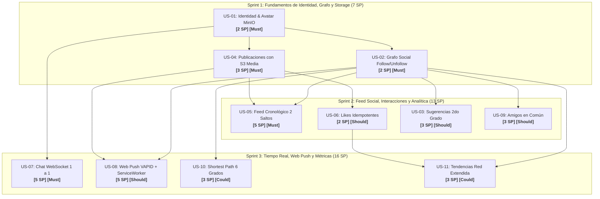

# Especificación de Arquitectura, Backlog Priorizado y Ejecución

```typescript
Desarrollado por:

- Paulo Orrala
- Carlos Patiño
- Angel Villon
```

Este documento consolida la arquitectura del sistema distribuido, el modelo de grafos, las consultas Cypher obligatorias, la priorización matemática del backlog (RICE y MoSCoW), la planificación de sprints y los criterios de aceptación exhaustivos en formato BDD/Gherkin para todo el equipo de desarrollo.

---

## 1. Topología y Mecanismos de Comunicación

| Necesidad del Sistema | Mecanismo Implementado | ¿Por qué esta tecnología? | ¿Qué problema resuelve? |
| :--- | :--- | :--- | :--- |
| **Operaciones Transaccionales** | **REST / HTTP (JSON)** | Protocolo sin estado (*stateless*), semántica estándar (GET, POST, DELETE). | Creación de cuentas, inicio de sesión, publicación y seguimiento sin sobrecoste de canal abierto. |
| **Chat en Vivo 1 a 1** | **WebSockets** | Conexión bidireccional TCP dúplex persistente con bajísima latencia. | Elimina la sobrecarga de cabeceras HTTP y el consumo ineficiente de CPU del *polling* periódico. |
| **Alertas fuera de la app** | **Web Push (VAPID)** | Estándar W3C soportado por el sistema operativo mediante *Service Workers*. | Permite notificar a los usuarios aunque tengan la pestaña cerrada o la aplicación en segundo plano. |
| **Grafo Social y Recomendación** | **Neo4j (Cypher)** | *Index-free adjacency*: cada nodo almacena punteros directos a sus relaciones adyacentes ($O(1)$ por salto). | Evita costosos `JOIN`s relacionales recursivos al consultar feeds, amigos en común o sugerencias de múltiples saltos. |
| **Multimedia de Publicaciones** | **MinIO (S3 Compatible)** | Almacenamiento desacoplado orientado a objetos con metadata. | Mantiene la base de datos de grafos liviana, delegando la persistencia de binarios pesados a un sistema escalable. |
| **Despliegue y Reproducibilidad** | **Docker & Compose** | Empaquetado inmutable y redes virtuales puente (*bridge*). | Garantiza que la topología distribuida arranque con un solo comando sin discrepancias de entorno. |

---

## 2. Modelo de Grafos en Neo4j

### Nodos y Propiedades
- **`(:Usuario)`**: `{id: String, username: String, email: String, nombre: String, avatarUrl: String, pushSubscriptionJson: String}`
- **`(:Post)`**: `{id: String, texto: String, mediaUrl: String, fechaCreacion: Long}`

### Relaciones
- `(:Usuario)-[:SIGUE {desde: Long}]->(:Usuario)`
- `(:Usuario)-[:PUBLICA]->(:Post)`
- `(:Usuario)-[:REACCIONA {tipo: 'LIKE', fecha: Long}]->(:Post)`

---

## 3. Catálogo de Consultas Cypher Obligatorias (No Triviales)

### 1. Feed Cronológico Filtrado por Grafo Social (2 Saltos)
Obtiene únicamente las publicaciones creadas por los usuarios que el solicitante sigue:
```cypher
MATCH (u:Usuario {id: $userId})-[:SIGUE]->(amigo:Usuario)-[:PUBLICA]->(p:Post)
OPTIONAL MATCH (p)<-[r:REACCIONA]-(:Usuario)
RETURN p.id AS id, 
       p.texto AS texto, 
       p.mediaUrl AS mediaUrl, 
       p.fechaCreacion AS fecha, 
       amigo.id AS autorId, 
       amigo.username AS autorUsername, 
       amigo.avatarUrl AS autorAvatar, 
       count(r) AS totalLikes, 
       EXISTS((u)-[:REACCIONA]->(p)) AS likedByMe
ORDER BY p.fechaCreacion DESC
LIMIT 20;
```

### 2. Algoritmo de Sugerencia de Usuarios (Red Social de Segundo Nivel)
Calcula recomendaciones basadas en conexiones mutuas ("amigos de amigos" que aún no sigue):
```cypher
MATCH (u:Usuario {id: $userId})-[:SIGUE]->(intermedio:Usuario)-[:SIGUE]->(sugerido:Usuario)
WHERE u <> sugerido AND NOT (u)-[:SIGUE]->(sugerido)
RETURN sugerido.id AS id, 
       sugerido.username AS username, 
       sugerido.nombre AS nombre, 
       sugerido.avatarUrl AS avatar, 
       count(intermedio) AS conexionesEnComun, 
       collect(intermedio.username) AS seguidosEnComun
ORDER BY conexionesEnComun DESC
LIMIT 5;
```

### 3. Seguidores y Conexiones en Común entre Dos Perfiles
Identifica la intersección de seguimiento entre dos perfiles analizados:
```cypher
MATCH (u1:Usuario {id: $userA})<-[:SIGUE]-(comun:Usuario)-[:SIGUE]->(u2:Usuario {id: $userB})
RETURN comun.id AS id, 
       comun.username AS username, 
       comun.nombre AS nombre, 
       comun.avatarUrl AS avatar;
```

### 4. Grado de Separación y Camino Más Corto (Shortest Path)
Calcula la cadena de conexiones mínimas que unen a dos usuarios distantes:
```cypher
MATCH p = shortestPath((origen:Usuario {id: $origenId})-[:SIGUE*..6]->(destino:Usuario {id: $destinoId}))
WHERE origen <> destino
RETURN [n IN nodes(p) | n.username] AS rutaConexion, 
       length(p) AS saltosTotales;
```

### 5. Tendencias en la Red Extendida (Posts con más interacción a 1 y 2 saltos)
Detecta publicaciones populares generadas dentro de la red cercana del usuario:
```cypher
MATCH (u:Usuario {id: $userId})-[:SIGUE*1..2]->(autor:Usuario)-[:PUBLICA]->(p:Post)
WHERE p.fechaCreacion >= datetime() - duration('P7D')
MATCH (reactor:Usuario)-[:REACCIONA]->(p)
RETURN p.id AS id, 
       p.texto AS texto, 
       autor.username AS autor, 
       count(reactor) AS totalReacciones
ORDER BY totalReacciones DESC
LIMIT 10;
```

---

## 4. Product Backlog Priorizado y Matriz de Decisión (RICE + MoSCoW)

La priorización se calculó combinando **MoSCoW** para el encuadre ágil de requerimientos y el algoritmo **RICE** ($\text{Score} = \frac{\text{Reach} \times \text{Impact} \times \text{Confidence}}{\text{Effort}}$):

- **Reach (Alcance):** Usuarios impactados por mes (1-100%).
- **Impact (Impacto):** 3 = Masivo, 2 = Alto, 1 = Medio, 0.5 = Bajo.
- **Confidence (Confianza):** 100% = Alta certeza técnica, 80% = Media, 50% = Experimental.
- **Effort (Esfuerzo en Story Points):** Secuencia Fibonacci acordada en Planning Poker.

| ID | Épica | Historia de Usuario | MoSCoW | RICE Score | Story Points | Sprint | Rama Git Sugerida |
| :--- | :--- | :--- | :---: | :---: | :---: | :---: | :--- |
| **US-01** | Identidad | Registro, sesión y perfil con avatar en MinIO | **Must** | **150.0** | **2 SP** | Sprint 1 | `feature/US-01-auth-perfil` |
| **US-02** | Grafo | Seguir, dejar de seguir y consultar red social | **Must** | **140.0** | **2 SP** | Sprint 1 | `feature/US-02-grafo-follow` |
| **US-04** | Contenido | Crear publicación con multimedia desacoplada en S3 | **Must** | **90.0** | **3 SP** | Sprint 1 | `feature/US-04-crear-post-s3` |
| **US-05** | Feed | Feed cronológico filtrado por grafo social (2 saltos) | **Must** | **60.0** | **5 SP** | Sprint 2 | `feature/US-05-feed-grafo` |
| **US-06** | Contenido | Reaccionar a publicaciones (Likes idempotentes) | **Should** | **75.0** | **2 SP** | Sprint 2 | `feature/US-06-reacciones-likes` |
| **US-03** | Grafo | Sugerencia inteligente de contactos (2do grado) | **Should** | **53.3** | **3 SP** | Sprint 2 | `feature/US-03-sugerencias-amigos` |
| **US-09** | Grafo | Conexiones y seguidores en común entre perfiles | **Should** | **40.0** | **3 SP** | Sprint 2 | `feature/US-09-amigos-en-comun` |
| **US-07** | Chat | Mensajería instantánea 1 a 1 vía WebSockets | **Must** | **40.0** | **5 SP** | Sprint 3 | `feature/US-07-chat-websocket` |
| **US-08** | Alertas | Notificaciones Web Push (VAPID) ante publicaciones | **Should** | **32.0** | **5 SP** | Sprint 3 | `feature/US-08-push-notifications` |
| **US-10** | Grafo | Camino más corto y grados de separación (Shortest Path) | **Could** | **20.0** | **3 SP** | Sprint 3 | `feature/US-10-shortest-path` |
| **US-11** | Métricas | Tendencias y posts populares en red extendida | **Could** | **20.0** | **3 SP** | Sprint 3 | `feature/US-11-tendencias-red` |

> **Capacidad Total del Proyecto:** 36 Story Points distribuidos en 3 Sprints balanceados.

---

## 5. Planificación de Sprints y Grafo de Dependencias



### Reglas de Calidad y Definición de Terminado

#### Definition of Ready (DoR) - Criterios para iniciar una historia:
1. Historia descrita en formato estándar (*Como... Quiero... Para...*).
2. Estimación acordada en Fibonacci y prioridad asignada.
3. Criterios de aceptación BDD/Gherkin definidos (Happy path y Casos de error).
4. Contrato de API JSON y consultas Cypher especificadas.
5. Dependencias técnicas previas fusionadas en la rama `develop`.

#### Definition of Done (DoD) - Criterios para dar por terminada una historia:
1. Código fuente implementado respetando Arquitectura Hexagonal en Quarkus y Feature-Driven en React.
2. Contrato REST / WebSocket verificado con `curl` o clientes de prueba.
3. Consultas Cypher probadas y optimizadas en `cypher-shell` con índices de nodo.
4. Cero advertencias críticas de compilación y linter.
5. Rama `feature/US-xx` integrada a `develop` mediante Pull Request aprobado por al menos un compañero de equipo.

---

## 6. Especificación BDD / Gherkin Completa (11 Historias de Usuario)

### US-01: Registro, Sesión y Perfil con Avatar en MinIO
```gherkin
Característica: Gestión de Identidad y Perfil de Usuario con Storage S3
  Como usuario de la red social
  Quiero registrar mis datos y subir mi fotografía de perfil
  Para ser identificado por mis colegas y formar parte del grafo social

  Escenario: Registro exitoso de nuevo usuario con persistencia en Neo4j
    Dado que no existe ningún nodo (:Usuario) con username "angelvillon"
    Cuando el cliente envía un POST a "/api/users" con:
      | id          | username    | email             | nombre       | avatarUrl                |
      | angel-v     | angelvillon | angel@upse.edu.ec | Angel Villon | https://s3/media/av1.png |
    Entonces el backend responde con código HTTP 201 Created
    Y se crea el nodo (:Usuario {id: 'angel-v', username: 'angelvillon'}) en Neo4j.

  Escenario: Intento de registro con identificador duplicado
    Dado que ya existe un nodo (:Usuario {id: 'angel-v'}) en Neo4j
    Cuando el cliente intenta enviar un POST a "/api/users" con el mismo "angel-v"
    Entonces el backend actualiza idempotentemente sus propiedades mediante MERGE
    Y no se duplica el nodo en el grafo.
```

### US-02: Grafo Social: Seguir, Dejar de Seguir y Consultar Red
```gherkin
Característica: Gestión de relaciones de seguimiento en el grafo social
  Como usuario activo
  Quiero seguir y dejar de seguir a otros perfiles
  Para personalizar mi red de contactos y recibir su contenido

  Escenario: Creación atómica de relación de seguimiento
    Dado que existen los nodos (:Usuario {id: 'carlos-patino'}) y (:Usuario {id: 'paulo-orrala'})
    Y actualmente NO existe la relación [:SIGUE] entre ellos
    Cuando "carlos-patino" envía un POST a "/api/users/carlos-patino/follow/paulo-orrala"
    Entonces el backend responde con código HTTP 200 OK
    Y en Neo4j se crea la arista (:Usuario {id: 'carlos-patino'})-[:SIGUE {desde: timestamp}]->(:Usuario {id: 'paulo-orrala'}).

  Escenario: Dejar de seguir a un usuario existente
    Dado que "carlos-patino" sigue a "paulo-orrala" con relación [:SIGUE]
    Cuando "carlos-patino" envía un DELETE a "/api/users/carlos-patino/follow/paulo-orrala"
    Entonces el backend responde con código HTTP 200 OK
    Y la arista [:SIGUE] entre ambos es eliminada de Neo4j sin borrar ninguno de los nodos.
```

### US-03: Sugerencia Inteligente de Contactos (Red Social de Segundo Nivel)
```gherkin
Característica: Algoritmo de recomendación de amigos de amigos
  Como usuario que busca expandir su red
  Quiero ver sugerencias de personas que mis contactos siguen
  Para conectar con colegas afines por amigos mutuos

  Escenario: Recomendación ponderada por cantidad de amigos en común
    Dado que "Carlos" sigue a "Beatriz" y a "Paulo"
    Y tanto "Beatriz" como "Paulo" siguen a "David"
    Y "Carlos" NO sigue a "David"
    Cuando "Carlos" solicita sugerencias en GET "/api/users/carlos/sugerencias"
    Entonces el servicio retorna a "David" como primer resultado
    Y el campo "conexionesEnComun" es igual a 2
    Y la lista "seguidosEnComun" incluye a "Beatriz" y a "Paulo".

  Escenario: Usuario sin conexiones de segundo nivel
    Dado que "Carlos" solo sigue a "Elena" y "Elena" no sigue a nadie
    Cuando "Carlos" consulta sus sugerencias
    Entonces el endpoint responde 200 OK con un array vacío "[]".
```

### US-04: Crear Publicación con Multimedia Desacoplada en S3
```gherkin
Característica: Publicación de contenidos con multimedia en MinIO
  Como creador de contenido
  Quiero escribir una publicación y adjuntar una imagen
  Para compartir novedades con mis seguidores sin saturar la base de grafos

  Escenario: Creación exitosa de post vinculando URL de S3 con nodo Neo4j
    Dado que el usuario "paulo-orrala" está autenticado
    Y la imagen ha sido subida exitosamente al bucket "redsocial-media" en MinIO
    Cuando se realiza un POST a "/api/posts" con texto "Arquitectura en Quarkus lista" y mediaUrl
    Entonces se crea el nodo (:Post) en Neo4j con UUID único y fechaCreacion
    Y se establece la relación (:Usuario {id: 'paulo-orrala'})-[:PUBLICA]->(:Post)
    Y el backend responde con código 201 Created y el identificador generado.

  Escenario: Rechazo de publicación sin autor válido
    Dado que no se suministra "autorId" en el cuerpo de la petición
    Cuando se realiza el POST a "/api/posts"
    Entonces el backend rechaza la operación con código de error HTTP 400 Bad Request.
```

### US-05: Feed Cronológico Filtrado por Grafo Social (2 Saltos)
```gherkin
Característica: Generación del feed a partir de relaciones de seguimiento
  Como usuario de la red social
  Quiero ver en mi muro únicamente los posts publicados por quienes sigo
  Para tener un espacio libre de spam y relevante a mis intereses

  Escenario: Filtrado estricto por grafo social a 2 saltos
    Dado que el usuario "Carlos" sigue a "Beatriz" en el grafo
    Y "Beatriz" ha publicado un post hace 1 hora
    Y "David" (a quien "Carlos" NO sigue) ha publicado un post hace 5 minutos
    Cuando "Carlos" solicita su feed principal en GET "/api/feed/carlos-patino"
    Entonces la consulta Cypher recorre (:Usuario {username: 'Carlos'})-[:SIGUE]->()-[:PUBLICA]->(:Post)
    Y el feed muestra la publicación de "Beatriz" ordenada cronológicamente
    Y la publicación de "David" es excluida taxativamente del resultado.

  Escenario: Cálculo de interacciones en el feed
    Dado que "Carlos" reaccionó previamente a la publicación de "Beatriz"
    Cuando "Carlos" consulta su feed
    Entonces la publicación de "Beatriz" incluye "likedByMe: true" y el conteo "totalLikes".
```

### US-06: Reaccionar a Publicaciones (Likes Idempotentes)
```gherkin
Característica: Sistema de reacciones a publicaciones
  Como usuario lector
  Quiero dar me gusta a un post
  Para expresar que me agrada el contenido sin duplicar interacciones

  Escenario: Registro de Me Gusta idempotente mediante MERGE
    Dado que existe una publicación con ID "post-99"
    Y el usuario "angel-villon" no ha reaccionado previamente
    Cuando envía un POST a "/api/posts/post-99/like" con body {"userId": "angel-villon"}
    Entonces se crea la relación (:Usuario)-[:REACCIONA {tipo: 'LIKE'}]->(:Post)
    Y el conteo de likes de la publicación aumenta en 1.

  Escenario: Intento repetido de reacción no duplica aristas
    Dado que ya existe la relación [:REACCIONA] entre "angel-villon" y "post-99"
    Cuando vuelve a enviar el POST de like
    Entonces la consulta Cypher MERGE actualiza la propiedad fecha sin duplicar la relación
    Y el total de likes permanece consistente.
```

### US-07: Chat Instantáneo 1 a 1 por WebSockets
```gherkin
Característica: Mensajería bidireccional en tiempo real
  Como usuario conectado
  Quiero conversar privadamente con otro usuario
  Para comunicarme al instante sin sobrecargar el servidor con sondeos periódicos

  Escenario: Entrega instantánea entre sesiones activas
    Dado que "Usuario 1" y "Usuario 2" tienen una sesión WebSocket abierta en "/chat/{userId}"
    Cuando "Usuario 1" envía un mensaje JSON:
      """
      {"destinatarioId": "user-2", "contenido": "Hola, ¿cómo va el sprint?", "timestamp": 1727270000}
      """
    Entonces el endpoint Quarkus enruta el paquete directamente al socket activo de "user-2"
    Y el mensaje aparece de inmediato en la pantalla de "user-2" con latencia menor a 100ms
    Y no se realiza ninguna petición HTTP de polling.

  Escenario: Envío a destinatario no conectado
    Dado que "user-2" no tiene una sesión WebSocket activa
    Cuando "user-1" envía un mensaje
    Entonces el servidor registra la ausencia en bitácora de servidor sin interrumpir la conexión de "user-1".
```

### US-08: Notificación Web Push ante Nueva Publicación
```gherkin
Característica: Notificación fuera del navegador con Web Push y VAPID
  Como suscriptor de una cuenta
  Quiero recibir una notificación del sistema operativo cuando publiquen nuevo contenido
  Para enterarme al instante incluso si tengo la pestaña cerrada

  Escenario: Disparo asíncrono de alertas push a seguidores registrados
    Dado que "Anthony" sigue a "Carlos" en el grafo social
    Y el nodo (:Usuario {username: 'Anthony'}) contiene un "pushSubscriptionJson" válido
    Cuando "Carlos" crea una nueva publicación vía POST "/api/posts"
    Entonces el backend detecta los seguidores con suscripción mediante consulta Cypher
    Y Quarkus despacha la carga útil cifrada con llaves VAPID al servicio Push del navegador
    Y el Service Worker de "Anthony" recibe el evento y despliega una notificación nativa.
```

### US-09: Seguidores y Conexiones en Común entre Dos Perfiles
```gherkin
Característica: Análisis de intersección de grafo entre dos perfiles
  Como usuario explorando la red
  Quiero ver qué contactos seguimos en común otra persona y yo
  Para validar referencias y confianza mutua

  Escenario: Detección de contactos puente compartidos
    Dado que "Carlos" y "Angel" tienen a "Paulo" y a "Beatriz" como seguidores mutuos
    Cuando se consulta GET "/api/users/comunes?userA=carlos-patino&userB=angel-villon"
    Entonces el backend ejecuta la consulta Cypher de intersección de caminos
    Y retorna una lista con los objetos de "Paulo" y "Beatriz" con sus datos de perfil.
```

### US-10: Grado de Separación y Camino Más Corto (Shortest Path)
```gherkin
Característica: Descubrimiento de ruta de conexión mínima entre usuarios
  Como usuario analizando la red
  Quiero conocer cuántos grados de distancia me separan de un usuario distante
  Para encontrar la ruta óptima de intermediarios para contactarlo

  Escenario: Cálculo de la cadena mínima de relaciones hasta 6 saltos
    Dado que "Carlos" sigue a "Beatriz", "Beatriz" sigue a "Elena" y "Elena" sigue a "Zulma"
    Cuando se solicita GET "/api/users/camino-corto?origen=carlos-patino&destino=zulma-id"
    Entonces el algoritmo Cypher shortestPath calcula la ruta
    Y responde con {"rutaConexion": ["carlos", "beatriz", "elena", "zulma"], "saltosTotales": 3}.

  Escenario: Usuarios sin conexión en la red
    Dado que no existe ningún camino navegable de seguimiento entre "Carlos" y "Desconocido"
    Cuando se solicita el camino más corto
    Entonces el endpoint responde con un objeto vacío o indicando saltos: -1.
```

### US-11: Tendencias en la Red Extendida a 1 y 2 Saltos
```gherkin
Característica: Detección de contenido popular en la red cercana
  Como usuario curioso
  Quiero descubrir las publicaciones más virales dentro de mi círculo extendido
  Para no perderme los debates importantes de mi comunidad

  Escenario: Filtrado de publicaciones virales en los últimos 7 días
    Dado que existen publicaciones creadas a 1 y 2 saltos de "carlos-patino"
    Y la publicación "post-viral" tiene 15 reacciones [:REACCIONA] acumuladas
    Cuando "carlos-patino" consulta GET "/api/posts/tendencias/carlos-patino"
    Entonces el servicio retorna el ranking de publicaciones ordenadas descendentemente por totalReacciones
    Y excluye publicaciones con antigüedad mayor a 7 días.
```

---

## 7. Matriz de Trazabilidad Técnica

| Historia | Endpoint / Protocolo | Consulta Cypher / Storage | Puerto Hexagonal Backend | Componente Frontend React |
| :--- | :--- | :--- | :--- | :--- |
| **US-01** | `POST /api/users` | `MERGE (u:Usuario {id: $id}) ...` | `GrafoPersistencePort.guardarUsuario()` | `shared/components/Navbar.tsx` |
| **US-02** | `POST / DELETE /api/users/{s}/follow/{d}` | `MERGE (a)-[r:SIGUE]->(b)` | `GrafoPersistencePort.seguirUsuario()` | `features/network/UserSuggestionsCard.tsx` |
| **US-03** | `GET /api/users/{id}/sugerencias` | Cypher #2 (Amigos mutuos 2do grado) | `GrafoPersistencePort.obtenerSugerenciasUsuarios()` | `features/network/UserSuggestionsCard.tsx` |
| **US-04** | `POST /api/posts` | `CREATE (p:Post), CREATE (u)-[:PUBLICA]->(p)` | `StorageMultimediaPort` + `GrafoPersistencePort` | `features/feed/CreatePostForm.tsx` |
| **US-05** | `GET /api/feed/{userId}` | Cypher #1 (Feed 2 saltos cronológico) | `GrafoPersistencePort.obtenerFeedCronologico()` | `features/feed/FeedList.tsx` + `PostCard.tsx` |
| **US-06** | `POST /api/posts/{id}/like` | `MERGE (u)-[r:REACCIONA]->(p)` | `GrafoPersistencePort.alternarLike()` | `features/feed/PostCard.tsx` |
| **US-07** | `WS /chat/{userId}` | WebSocket dúplex TCP en memoria | `ChatWebSocket.java` (Session Map) | `features/chat/ChatWidget.tsx` |
| **US-08** | Evento en `CrearPostUseCase` | Cypher seguidores con Push Subscription | `NotificationPushPort` (VAPID) | `features/notifications/pushService.ts` |
| **US-09** | `GET /api/users/comunes` | Cypher #3 (Intersección de amigos) | `GrafoPersistencePort.obtenerSeguidoresEnComun()` | `features/network/MutualFriendsModal.tsx` |
| **US-10** | `GET /api/users/camino-corto` | Cypher #4 (shortestPath 6 grados) | `GrafoPersistencePort.obtenerCaminoMasCorto()` | `features/network/DegreeSeparationModal.tsx` |
| **US-11** | `GET /api/posts/tendencias/{id}` | Cypher #5 (Tendencias red 7 días) | `GrafoPersistencePort.obtenerTendenciasRedExtendida()` | `features/feed/TrendingSidebar.tsx` |
