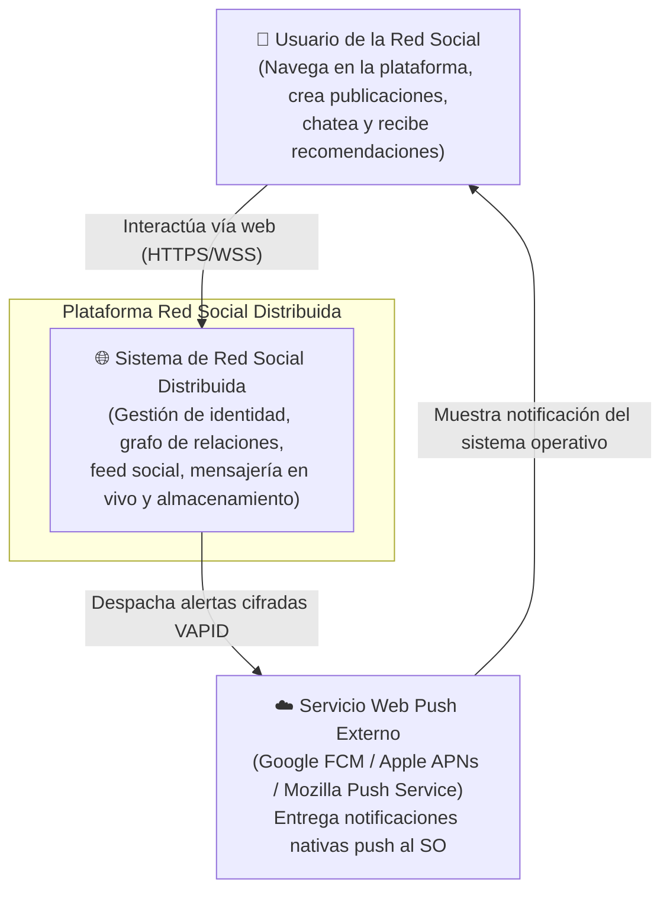
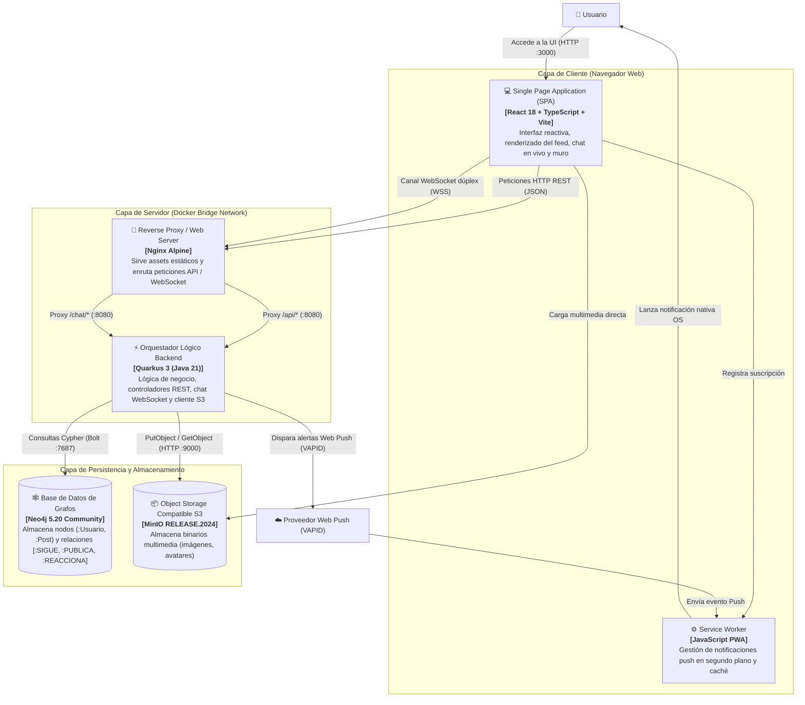
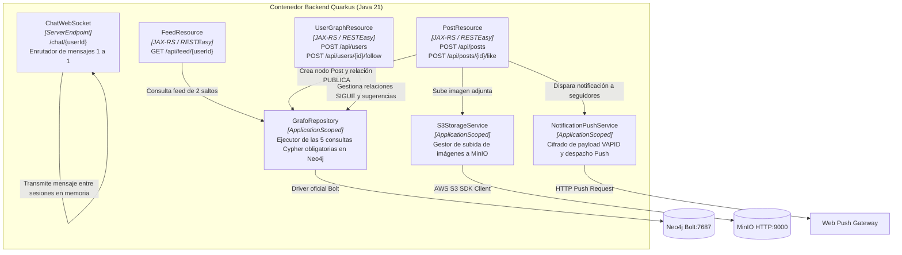
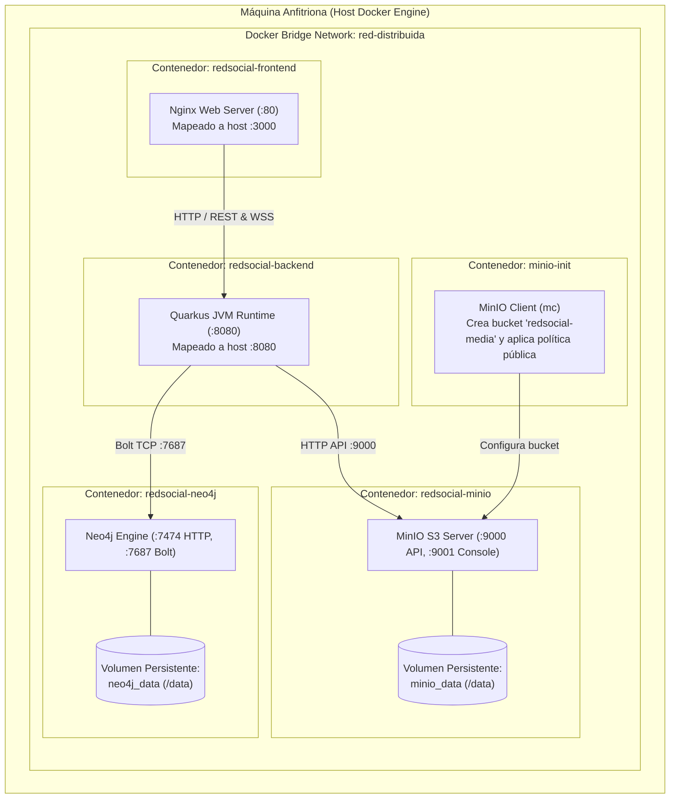

# Diseño del Sistema - Modelo C4

Este documento describe la arquitectura de la **Red Social Distribuida** empleando el **Modelo C4** (Contexto, Contenedores, Componentes y Despliegue), permitiendo visualizar el sistema a diferentes niveles de abstracción.

---

## Nivel 1: Diagrama de Contexto del Sistema (System Context)

El diagrama de contexto ilustra cómo los usuarios interactúan con la plataforma de la Red Social Distribuida y su relación con sistemas y servicios externos (como los proveedores de Web Push de los navegadores y el sistema operativo).

### Elementos del Contexto:
- **Usuario:** Usuario autenticado que publica contenido multimedia, reacciona a posts, sigue a otros integrantes, mantiene conversaciones por chat y recibe recomendaciones en base a sus amigos mutuos.
- **Sistema de Red Social Distribuida:** Núcleo de la plataforma distribuida compuesto por frontend reactivo, orquestador backend, base de datos orientada a grafos y almacenamiento de objetos S3.
- **Servicio Web Push Externo:** Red de mensajería nativa estándar del navegador (Mozilla, Google Chrome, Safari) que entrega notificaciones al sistema operativo del usuario aunque la pestaña esté cerrada.

---

## Nivel 2: Diagrama de Contenedores (Containers)

El diagrama de contenedores desglosa la aplicación en aplicaciones ejecutables, almacenes de datos y protocolos de comunicación que componen la topología distribuida.

### Contenedores y Roles:
1. **React SPA:** Interfaz de usuario empaquetada con TypeScript y Vite. Muestra el feed generado por grafos y gestiona la sesión WebSocket.
2. **Service Worker:** Script en segundo plano del navegador que atiende eventos `push` y muestra notificaciones toast en el sistema operativo.
3. **Nginx Reverse Proxy:** Servidor web perimetral que unifica el origen web y redirige tráfico HTTP y WebSockets al backend.
4. **Quarkus Backend:** Microservicio Java de alto rendimiento con tiempo de arranque ultra rápido y bajo consumo de memoria. Expone APIs REST y maneja WebSockets dúplex.
5. **Neo4j:** Base de datos NoSQL de grafos nativos (*Index-Free Adjacency*). Ejecuta consultas Cypher avanzadas para feeds, sugerencias y caminos mínimos.
6. **MinIO:** Servidor de objetos compatible con AWS S3 que desacopla la carga de archivos binarios pesados fuera de la base de datos transaccional.

---

## Nivel 3: Diagrama de Componentes (Components - Backend Quarkus)

Este nivel detalla la arquitectura interna del contenedor **Quarkus Backend**, mostrando sus clases y responsabilidades.

### Componentes Clave:
- **`FeedResource`:** Resuelve la solicitud de feed del usuario invocando la consulta de 2 saltos en Neo4j.
- **`PostResource`:** Recibe las publicaciones, coordina el almacenamiento de la imagen en MinIO mediante `S3StorageService`, persiste los nodos en Neo4j y gatilla `NotificationPushService`.
- **`UserGraphResource`:** Expone endpoints para crear conexiones `[:SIGUE]`, calcular amigos sugeridos de 2º nivel y calcular el camino más corto (*shortest path*).
- **`ChatWebSocket`:** Mantiene un registro de sesiones activas concurrentes para enrutar mensajes directamente de emisor a receptor sin latencia.
- **`GrafoRepository`:** Centraliza las 5 consultas Cypher no triviales utilizando transacciones administradas del driver oficial de Neo4j.

---

## Nivel 4: Diagrama de Despliegue (Deployment)

Describe la infraestructura física y virtual orquestada mediante Docker Compose.

---

## Resumen de Decisiones de Arquitectura (ADR)

1. **Neo4j para el Grafo Social:**
   - *Decisión:* Usar Neo4j en lugar de tablas intermedias relacionales SQL con múltiples `JOIN`s recursivos.
   - *Justificación:* Ofrece complejidad temporal $O(k)$ por salto mediante *Index-Free Adjacency*, optimizando consultas como "amigos de mis amigos" y caminos más cortos.

2. **MinIO S3 para Multimedia:**
   - *Decisión:* Separar binarios en Object Storage en lugar de BLOBs en base de datos.
   - *Justificación:* Evita sobrecargar la memoria de la base de datos de grafos y permite distribución estática escalable con URLs pre-firmadas o directas.

3. **WebSockets para Chat en Vivo:**
   - *Decisión:* Conexión dúplex persistente en Quarkus en lugar de HTTP Polling.
   - *Justificación:* Reduce la sobrecarga de cabeceras HTTP a casi cero y provee tiempos de respuesta inferiores a 100 ms.

4. **Web Push con VAPID:**
   - *Decisión:* Notificaciones estándar W3C con Service Worker.
   - *Justificación:* Alerta a los usuarios sobre nuevas publicaciones de personas a quienes siguen incluso cuando no tienen el sitio abierto en primer plano.
