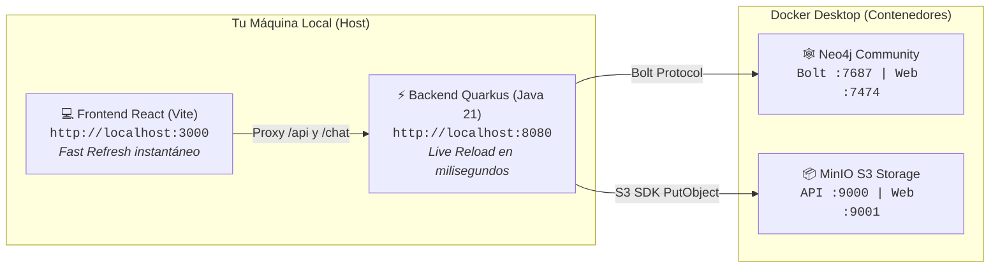

# 💻 Guía de Despliegue Local y Entorno de Desarrollo para Programadores

```typescript
Red Social Distribuida - UPSE
Equipo: Paulo Orrala | Carlos Patiño | Angel Villon
```

Esta guía proporciona el paso a paso exacto para que cualquier programador del equipo clone el repositorio, levante los servicios, cargue los datos de prueba y comience a desarrollar y probar nuevas funcionalidades en menos de 5 minutos y sin fricción de configuración.

---

## 📋 1. Requisitos Previos

Antes de comenzar, asegúrate de tener instalado en tu máquina:

- **Git** (v2.30 o superior)
- **Docker Desktop** (con Docker Compose v2) en ejecución.
- **Java Development Kit (JDK 21)** (recomendado Eclipse Temurin u OpenJDK 21).
- **Apache Maven** (v3.9 o superior).
- **Node.js** (v18 LTS o v20 LTS) y **npm**.

---

## ⚡ 2. Modo Desarrollo Ágil con Hot-Reload (Recomendado)

Este modo es el preferido para programar diariamente. Levanta únicamente las bases de datos y el storage en Docker, mientras el backend (Quarkus) y el frontend (React/Vite) corren en local con recarga en caliente (*Hot-Reload / Fast Refresh*).



### Paso 1: Levantar Infraestructura de Persistencia en Docker
Desde la raíz del proyecto, ejecuta:
```bash
docker compose up -d neo4j minio minio-init
```
> El contenedor `minio-init` creará automáticamente el bucket `redsocial-media` y le otorgará permisos públicos de lectura.

### Paso 2: Cargar el Dataset Semilla en Neo4j
Para que tengas usuarios de prueba (Carlos, Beatriz, Paulo, Angel, David, Elena), relaciones sociales y posts listos para interactuar:

- **En Windows (PowerShell):**
  ```powershell
  Get-Content docker\neo4j-seed.cql | docker exec -i redsocial-neo4j cypher-shell -u neo4j -p password123
  ```

- **En Linux / macOS / Git Bash:**
  ```bash
  cat docker/neo4j-seed.cql | docker exec -i redsocial-neo4j cypher-shell -u neo4j -p password123
  ```

- **Alternativa Visual (Neo4j Browser):**
  Abre [http://localhost:7474](http://localhost:7474), ingresa usuario `neo4j` y contraseña `password123`. Abre el archivo [`docker/neo4j-seed.cql`](file:///C:/Users/OMEN/nuevo-proyecto/docker/neo4j-seed.cql), copia todo su contenido, pégalo en la barra superior de Cypher y presiona **Ctrl + Enter**.

### Paso 3: Iniciar Backend Quarkus en Modo Dev
Abre una terminal dedicada para el backend:
```bash
cd backend
mvn quarkus:dev
```
* **Estado:** Quarkus iniciará en `http://localhost:8080`.
* **Live Reload:** Cualquier cambio que hagas en clases Java (`.java`) o en `application.properties` se recompila en caliente al hacer una petición, sin reiniciar el servidor.
* **Swagger UI interactivo:** [http://localhost:8080/q/swagger-ui](http://localhost:8080/q/swagger-ui)
* **Dev UI de Quarkus:** [http://localhost:8080/q/dev](http://localhost:8080/q/dev)

### Paso 4: Iniciar Frontend React con Vite
Abre una segunda terminal para el frontend:
```bash
cd frontend
npm install
npm run dev
```
* **Estado:** La aplicación web abrirá en [http://localhost:3000](http://localhost:3000).
* **Proxy automático:** Vite redirige transparentemente las llamadas `/api/*` a `http://localhost:8080` y los sockets `/chat/*` a `ws://localhost:8080`, por lo que no tendrás problemas de CORS.

---

## 🐳 3. Modo Despliegue Completo en Contenedores (Demo / Producción)

Si deseas levantar toda la solución empaquetada en contenedores exactamente como corre en producción:

```bash
# 1. Construir y levantar todos los contenedores en segundo plano
docker compose up --build -d

# 2. Cargar datos semilla una vez que Neo4j esté saludable
docker exec -i redsocial-neo4j cypher-shell -u neo4j -p password123 < docker/neo4j-seed.cql

# 3. Inspeccionar logs en vivo de los servicios
docker compose logs -f backend frontend
```

Para detener todos los servicios y liberar memoria:
```bash
docker compose down
```

---

## 🧭 4. Mapa de Consolas y Puertos de la Plataforma

| Servicio | URL Local | Credenciales por Defecto | Propósito / Funcionalidad |
| :--- | :--- | :--- | :--- |
| **Frontend Web** | [http://localhost:3000](http://localhost:3000) | N/A | UI React con muro social, sugerencias y chat. |
| **Quarkus Dev UI** | [http://localhost:8080/q/dev](http://localhost:8080/q/dev) | N/A | Panel de control de extensiones, logs y métricas. |
| **Swagger UI** | [http://localhost:8080/q/swagger-ui](http://localhost:8080/q/swagger-ui) | N/A | Documentación y prueba interactiva de endpoints REST. |
| **Neo4j Browser** | [http://localhost:7474](http://localhost:7474) | `neo4j` / `password123` | Explorador gráfico de nodos, aristas e interprete Cypher. |
| **MinIO Console** | [http://localhost:9001](http://localhost:9001) | `minioadmin` / `minioadmin` | Administrador visual de buckets y archivos S3. |
| **Protocolo Bolt** | `bolt://localhost:7687` | `neo4j` / `password123` | Canal TCP binario utilizado por Quarkus. |
| **API S3 MinIO** | `http://localhost:9000` | `minioadmin` / `minioadmin` | Endpoint S3 compatible para subida multimedia. |

---

## 🔑 5. Configuración de Notificaciones Web Push (VAPID)

Para probar las notificaciones nativas en el sistema operativo:

1. Ejecuta en tu terminal:
   ```bash
   npx web-push generate-vapid-keys
   ```
2. Obtendrás un par de claves:
   - `Public Key:` Clave pública para el navegador y el frontend.
   - `Private Key:` Clave privada para Quarkus backend.
3. Copia estos valores en `backend/src/main/resources/application.properties`:
   ```properties
   redsocial.vapid.public-key=TU_CLAVE_PUBLICA_AQUI
   redsocial.vapid.private-key=TU_CLAVE_PRIVADA_AQUI
   redsocial.vapid.subject=mailto:admin@redsocial.edu.ec
   ```

---

## 🔄 6. Ciclo de Desarrollo Diario del Programador

Sigue este flujo estándar para no romper la rama compartida:

```bash
# 1. Asegúrate de tener la versión más fresca de develop
git checkout develop
git pull origin develop

# 2. Crea tu rama para la historia asignada (ejemplo TUX-05)
git checkout -b feature/US-05-feed-grafo

# 3. Desarrolla y prueba tus cambios con hot-reload local
# Consulta los comandos curl de prueba en docs/backlog-programadores.md

# 4. Confirma tus cambios siguiendo Conventional Commits
git add .
git commit -m "feat(feed): implement Cypher query for 2-hop social feed"

# 5. Sube tu rama a GitHub
git push -u origin feature/US-05-feed-grafo

# 6. Abre un Pull Request hacia la rama 'develop' y notifica a tus compañeros
```

---

## 🛠️ 7. Preguntas Frecuentes y Solución de Problemas (Troubleshooting)

### ❓ 1. Error `Port 8080 (or 3000) is already in use`
* **Causa:** Hay otra instancia de Quarkus, Vite o un contenedor corriendo en ese puerto.
* **Solución:**
  - Si tienes un contenedor previo: ejecuta `docker compose down`.
  - En Windows (PowerShell) para ver qué proceso ocupa el puerto 8080:
    ```powershell
    Get-Process -Id (Get-NetTCPConnection -LocalPort 8080).OwningProcess | Stop-Process -Force
    ```

### ❓ 2. Error al conectar a Neo4j `Connection refused: localhost:7687`
* **Causa:** El contenedor de Neo4j está inicializando sus índices y APOC (toma de 10 a 20 segundos).
* **Solución:** Verifica que el contenedor esté en estado saludable con:
  ```bash
  docker compose ps
  ```
  Espera a que el estado de `redsocial-neo4j` cambie a `healthy`.

### ❓ 3. Las imágenes de MinIO devuelven 403 Forbidden
* **Causa:** El bucket se creó sin la política anónima de descarga.
* **Solución:** Ejecuta el inicializador manual:
  ```bash
  docker compose run --rm minio-init
  ```

### ❓ 4. ¿Cómo reiniciar la base de datos limpia desde cero?
* Si hiciste pruebas y quieres empezar el grafo limpio:
  ```bash
  # Eliminar volúmenes y reiniciar contenedores
  docker compose down -v
  docker compose up -d neo4j minio minio-init
  # Volver a inyectar la semilla
  Get-Content docker\neo4j-seed.cql | docker exec -i redsocial-neo4j cypher-shell -u neo4j -p password123
  ```
